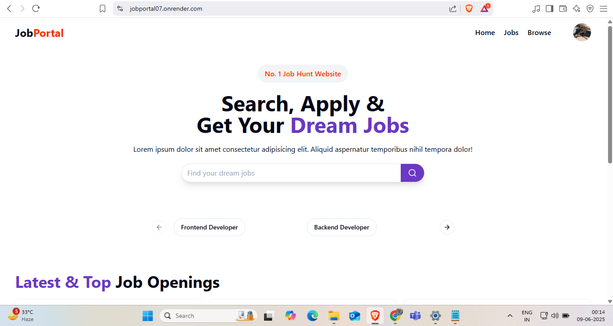
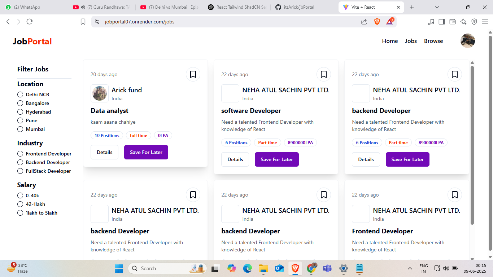

# 🧑‍💼 JobPortal - MERN Stack Job Hunt Platform

Live Website 👉 [jobportal07.onrender.com](https://jobportal07.onrender.com)

JobPortal is a full-stack job application platform where recruiters can post job openings and candidates can browse, filter, and apply to jobs based on various preferences like location, salary, and required skills.


## ✨ Features

### 👨‍💼 Recruiter Mode (Admin)
- Create and manage company profiles
- Post, edit, and delete job openings
- Add number of positions, job types, salary info, and skill requirements
- Dashboard to manage applications

### 🙋‍♂️ Candidate Mode (Student/Employee)
- User authentication (Sign Up / Login)
- Browse jobs by title, location, industry, and salary range
- Save jobs for later
- Apply directly to relevant openings
- Upload resumes

### 📊 General Platform Features
- MERN Stack with Vite + React
- TailwindCSS + ShadCN UI for fast and elegant design
- Role-based access control
- Advanced job filtering (location, salary, type)
- Clean and responsive UI
- Resume upload support
- Modern carousel to showcase featured jobs
- Light/Dark mode support

---

## 🖼️ Screenshots

### 🔍 Homepage


### 💼 Job Listings Page



## ⚙️ Tech Stack

| Category | Tech |
|----------|------|
| **Frontend** | React, Vite, Tailwind CSS, ShadCN UI |
| **Backend** | Node.js, Express |
| **Database** | MongoDB |
| **State Management** | Redux Toolkit, Redux Persist |
| **Authentication** | JWT-based Role Auth |
| **Deployment** | Render (Frontend + Backend) |

---

## 🚀 Getting Started

### Prerequisites

- Node.js and npm
- MongoDB (Local or Atlas)

### Installation

1. Clone the repository:

```bash
git clone https://github.com/itsArick/jbPortal.git
cd jbPortal
